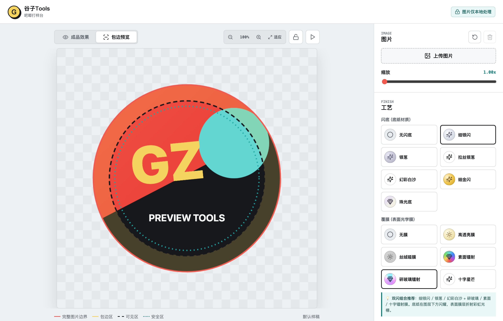
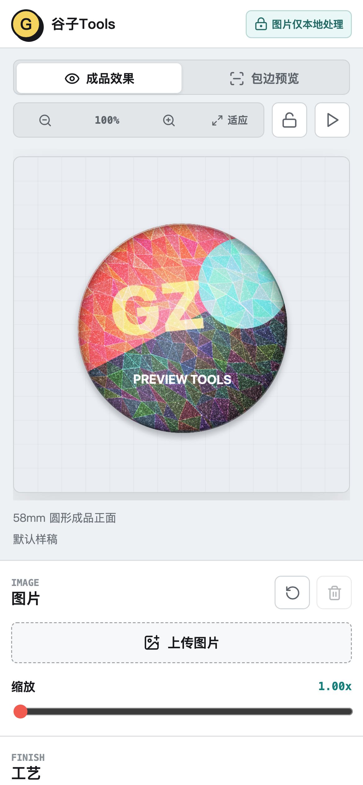

<div align="center">

# 🧷 Goods-Tools (谷子周边打样工具箱)

**面向二次元创作者与周边爱好者的开源谷子打样、工艺模拟与排版工具箱**

[](https://react.dev/)
[](https://www.typescriptlang.org/)
[](https://vitejs.dev/)
[](LICENSE)
[](#-隐私与数据说明)

[项目简介](#-项目简介) • [品类支持与规划](#-品类支持与规划) • [吧唧打样台特性](#-吧唧打样台模块已就绪) • [界面预览](#-界面预览) • [快速启动](#-快速启动) • [技术架构](#-技术架构)

<br />


</div>

---

## 📖 项目简介

**Goods-Tools** 是一个轻量、实用的二次元谷子（周边）打样与排版工具箱。项目旨在帮助同人创作者、画师及周边爱好者在送厂印制前，直观预览不同周边品类与工艺组合的成品效果，校对裁切与安全区规范，并导出符合工厂标准的 300 DPI 制作原图。

所有图像处理与渲染均在**浏览器本地内存**中完成，零数据上云，保障画稿资产安全。

---

## 🗺️ 品类支持与规划

项目采用模块化工具箱架构，涵盖谷圈常见的多种周边形态：

| 周边品类 | 状态 | 核心功能与工艺支持 |
| :--- | :---: | :--- |
| **🧷 马口铁吧唧 (Badge Studio)** | **已就绪** | 25~75mm 常用尺寸、圆/方双模具、冲压包边规范、7 款闪底 + 6 款覆膜双闪复合、360° 展示动效、300 DPI 印刷图导出 |
| **🎨 金边/烫金色纸 (Shikishi Studio)** | 规划中 | 2mm 断面卡纸质感、四边烫金边框（金/银/镭射边）、局部烫金反光遮罩 |
| **📸 拍立得/收藏小卡 (Photocard Studio)** | 规划中 | 经典拍立得边框模板、圆角冲切、手写签名层、正反双面覆膜预览 |
| **🎟️ PET透卡 / 镭射票 (Ticket Studio)** | 规划中 | 透明 PET 材质透光预览、局部白墨遮光对比、票根撕线齿孔 |
| **🪆 亚克力立牌 / 挂件 (Acrylic Studio)** | 规划中 | 透明夹层与折射、自动生成外轮廓切割线（Cutline）、底座插榫孔位辅助 |

---

## 🧷 吧唧打样台模块（已就绪）

作为 Goods-Tools 的首发模块，吧唧打样台现已完整支持以下功能：

- **程序化工艺模拟（双闪复合）**
  - **7 款底纸闪底**：无闪底（纯白卡）、细银闪（高密微晶）、银葱（六边形大亮片）、拉丝银葱（金属拉丝+细闪）、幻彩白沙（偏光白沙）、细金闪（香槟金）、珠光底（贝母偏光）；
  - **6 款表面光学覆膜**：无膜、高透亮膜、丝绒哑膜（磨砂）、素面镭射（彩虹光谱）、碎玻璃镭射（多面水晶晶格）、十字星芒膜；
  - 支持底纸与表层膜自由叠加，底纸闪粉在暗部闪烁，表层膜随光源折射彩光。
- **360° 环形展示动效**
  - 模拟手持吧唧在光源下连续圆周倾斜转动的轨迹，动态观察表面高光、色散光谱与地面投影变化。
- **工业包边与安全区规范**
  - 覆盖 25mm / 32mm / 44mm / 58mm / 75mm 尺寸及圆形、方形模具；
  - 自动标示冲压折边区（6.0mm）与建议安全区，杜绝文字或重要构图被卷入金属边缘。
- **300 DPI 印刷原图导出**
  - 模态弹窗核对导出规格，一键导出严格符合工业印刷分辨率的无损 PNG 制作原图。
- **视口比例尺与构图防误触**
  - 顶部提供 50%~250% 视口比例尺，方便微距查看工艺细节；
  - 滚轮不劫持缩放，放大后可平滑滚动漫游；支持一键锁定构图。
- **多端响应式适配**
  - 针对 PC 桌面端与移动端小屏分别进行布局优化，支持触控操作。

---

## 🖼️ 界面预览

<table width="100%">
  <tr>
    <td width="50%" align="center">
      <strong>桌面端效果预览</strong><br /><br />
      
    </td>
    <td width="50%" align="center">
      <strong>冲压包边与安全区规范</strong><br /><br />
      
    </td>
  </tr>
  <tr>
    <td width="50%" align="center">
      <strong>300 DPI 原图导出弹窗</strong><br /><br />
      
    </td>
    <td width="50%" align="center">
      <strong>移动端界面适配</strong><br /><br />
      
    </td>
  </tr>
</table>

---

## 🚀 快速启动

### 环境要求
- [Node.js](https://nodejs.org/) `>= 18.0.0`
- [npm](https://www.npmjs.com/) `>= 9.0.0`

### 本地运行

```bash
# 1. 安装依赖
npm install

# 2. 启动本地开发服务
npm run dev
```

启动后在浏览器中访问控制台输出的本地地址（默认 `http://localhost:5173`）即可使用。

### 常用命令

```bash
# 运行单元测试
npm test

# 执行 TypeScript 类型检查
npm run typecheck

# 构建生产版本（产物输出至 dist/）
npm run build
```

---

## 🛠️ 技术架构

```
goods-tools/
├── src/
│   ├── App.tsx          # 页面主布局、视口控制、动效循环与弹窗系统
│   ├── canvas.ts        # Canvas 光学着色引擎 (闪底、覆膜、双闪复合、穹顶光照、包边)
│   ├── geometry.ts      # 工业尺寸换算 (300 DPI 像素计算、包边与安全区约束)
│   ├── geometry.test.ts # 尺寸与几何算法测试套件
│   ├── styles.css       # 样式系统、Design Token 与移动端响应式布局
│   └── main.tsx         # 入口文件
├── docs/                # 产品与技术文档
│   ├── feature-overview.md # 功能规范与工艺定义
│   ├── tech-stack.md       # 技术方案与着色原理
│   └── images/             # 界面演示截图
└── package.json
```

- **核心技术选型**：
  - **前端框架**：React 19 + TypeScript
  - **构建工具**：Vite 8
  - **渲染核心**：HTML5 2D Canvas（轻量程序化光照与多图层合成）
  - **图标组件**：Lucide React
  - **测试运行**：Node.js Native Test Runner (`node:test`)

---

## 🛡️ 隐私与数据说明

- **100% 本地处理**：所有画稿的载入、裁剪、工艺预览与原图导出均在用户浏览器本地完成；
- **不保留任何数据**：无后端上传接口，关闭或刷新网页后，相关图片数据即从内存中释放。

---

## 📄 开源协议

本项目基于 [MIT License](LICENSE) 协议开源。
