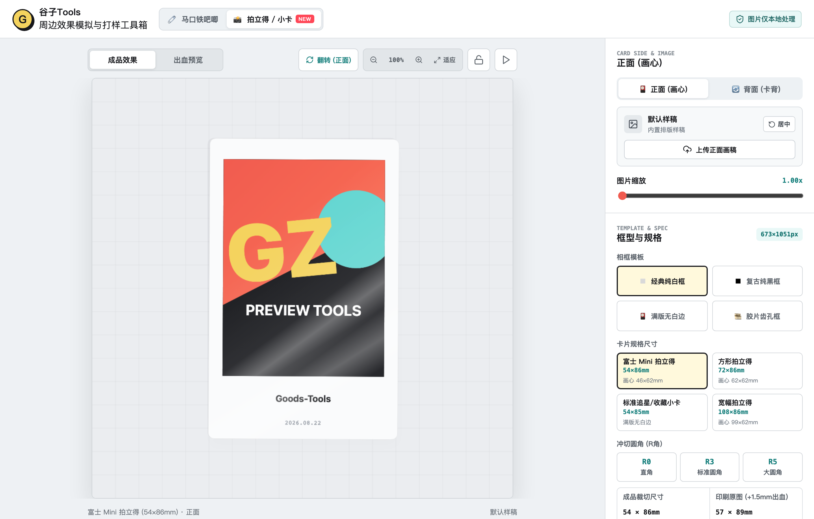
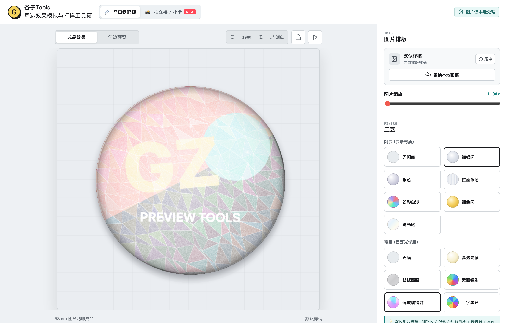
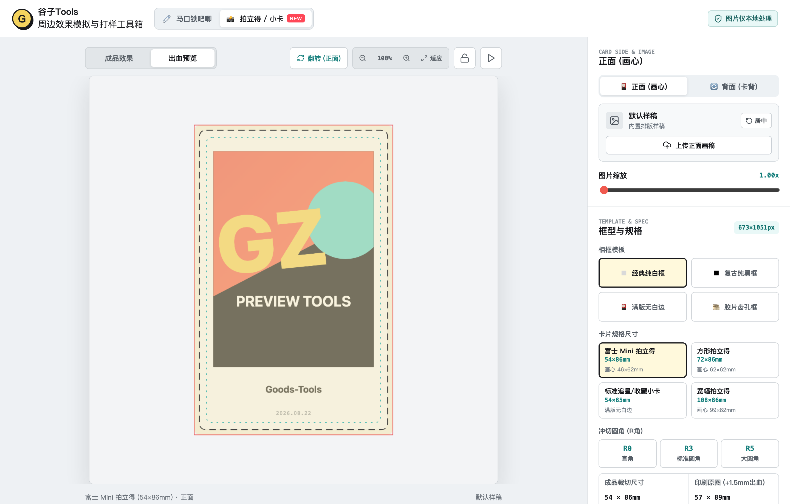
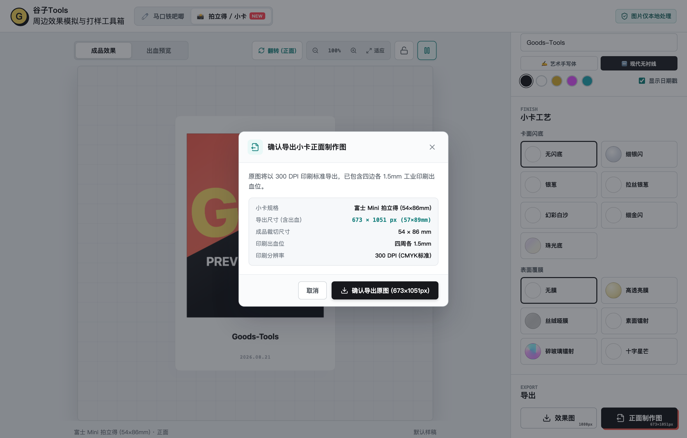

<div align="center">

# 🧷 Goods-Tools (谷子周边打样工具箱)

**面向二次元创作者与周边爱好者的开源谷子打样、工艺模拟与排版工具箱**

[](https://react.dev/)
[](https://www.typescriptlang.org/)
[](https://vitejs.dev/)
[](LICENSE)
[](#-隐私与数据说明)

[项目简介](#-项目简介) • [品类支持与规划](#-品类支持与规划) • [核心模块特性](#-核心模块特性) • [界面预览](#-界面预览) • [快速启动](#-快速启动) • [技术架构](#-技术架构)

<br />



</div>

---

## 📖 项目简介

**Goods-Tools** 是一个轻量、实用的二次元谷子（周边）打样与排版工具箱。项目旨在帮助同人创作者、画师及周边爱好者在送厂印制前，直观预览不同周边品类与工艺组合的成品效果，校对裁切与安全区规范，并导出符合工厂标准的 300 DPI 制作原图。

所有图像处理与渲染均在**浏览器本地内存**中完成，零数据上云，保障画稿资产安全。

---

## 🗺️ 品类支持与规划

项目采用模块化「Core 核心底座 + Studios 多品类工作室」架构：

| 周边品类 | 状态 | 核心功能与工艺支持 |
| :--- | :---: | :--- |
| **🧷 马口铁吧唧 (Badge Studio)** | **已就绪** | 25~75mm 常用尺寸、圆/方双模具、冲压包边规范、7 款闪底 + 6 款覆膜双闪复合、360° 展示动效、300 DPI 印刷图导出 |
| **📸 拍立得/收藏小卡 (Photocard Studio)** | **已就绪** | 富士Mini/方框/小卡/宽幅 4 款规格、4 款相框模板、300g 纸卡立体厚度、正反双面打样、手写签名与日期戳、1.5mm 出血线预览与 300 DPI 导出 |
| **🎨 金边/烫金色纸 (Shikishi Studio)** | 规划中 | 2mm 断面卡纸质感、四边烫金边框（金/银/镭射边）、局部烫金反光遮罩 |
| **🎟️ PET透卡 / 镭射票 (Ticket Studio)** | 规划中 | 透明 PET 材质透光预览、局部白墨遮光对比、票根撕线齿孔 |
| **🪆 亚克力立牌 / 挂件 (Acrylic Studio)** | 规划中 | 透明夹层与折射、自动生成外轮廓切割线（Cutline）、底座插榫孔位辅助 |

---

## ✨ 核心模块特性

### 1. 🧷 马口铁吧唧打样台 (Badge Studio)
- **程序化工艺模拟（双闪复合）**：
  - **7 款底纸闪底**：无闪底（纯白卡）、细银闪（高密微晶）、银葱（六边形大亮片）、拉丝银葱（金属拉丝+细闪）、幻彩白沙（偏光白沙）、细金闪（香槟金）、珠光底（贝母偏光）；
  - **6 款表面光学覆膜**：无膜、高透亮膜、丝绒哑膜（磨砂）、素面镭射（彩虹光谱）、碎玻璃镭射（多面水晶晶格）、十字星芒膜；
- **360° 环形展示动效**：模拟手持吧唧在光源下连续圆周倾斜转动的轨迹，动态观察表面高光、色散光谱与地面投影变化；
- **冲压包边与安全区规范**：覆盖 25mm / 32mm / 44mm / 58mm / 75mm 尺寸及圆形、方形模具，标示冲压折边区与建议安全区；
- **300 DPI 印刷原图导出**：一键导出严格符合工业印刷分辨率的无损 PNG 制作原图。

### 2. 📸 拍立得/收藏小卡打样台 (Photocard Studio)
- **多款相纸规格与模板**：
  - **4 种主流规格**：富士 Mini 拍立得 (54×86mm)、方形拍立得 (72×86mm)、标准追星/收藏小卡 (54×85mm)、宽幅拍立得 (108×86mm)；
  - **4 款边框模板**：经典纯白相框、复古纯黑相框、满版无白边小卡、复古胶片齿孔相框；
  - **冲切圆角 (R角)**：直角 (R0)、标准圆角 (R3)、大圆角 (R5)；
- **300g 相纸立体拟真**：硬质卡纸断面微反光、高光倒角与软阴影；
- **正反双面打样系统**：支持独立上传正面画稿与背面卡背，一键翻转查看；
- **底部手写签名与日期戳**：支持在拍立得留白区自定义输入手写印签，提供黑/白/金/粉/蓝多色笔迹与日期戳记；
- **1.5mm 工业印刷出血位规范与 300 DPI 原图导出**。

---

## 🖼️ 界面预览

<table width="100%">
  <tr>
    <td width="50%" align="center">
      <strong>📸 拍立得/小卡打样台</strong><br /><br />
      
    </td>
    <td width="50%" align="center">
      <strong>🧷 马口铁吧唧打样台</strong><br /><br />
      
    </td>
  </tr>
  <tr>
    <td width="50%" align="center">
      <strong>📏 小卡 1.5mm 出血位参考线</strong><br /><br />
      
    </td>
    <td width="50%" align="center">
      <strong>📄 300 DPI 印刷图导出弹窗</strong><br /><br />
      
    </td>
  </tr>
</table>

---

## 🚀 快速启动

### 环境要求
- [Node.js](https://nodejs.org/) `>= 18.0.0`
- [npm](https://www.npmjs.com/) `>= 9.0.0`

### 本地运行

```bash
# 1. 克隆仓库
git clone https://github.com/rianlu/goods-tools.git
cd goods-tools

# 2. 安装依赖
npm install

# 3. 启动本地开发服务
npm run dev

# 4. 生产构建打包
npm run build
```

---

## 🏛️ 技术架构

项目基于模块化分层设计：

```text
src/
├── core/                                # 通用核心层 (全品类完全复用)
│   ├── engine/                          # 渲染与光学着色引擎 (物理光照、闪粉微粒、覆膜色散)
│   ├── geometry/                        # 工业几何计算 (300 DPI 换算、构图边界约束)
│   ├── components/                      # 公共 UI 控件 (顶栏品类切换、舞台工具栏、导出弹窗)
│   └── types.ts                         # 全局类型系统
│
├── studios/                             # 各周边品类独立工作室
│   ├── badge/                           # 🧷 马口铁吧唧工作室 (冲压折边、穹顶光照、尺寸预设)
│   └── photocard/                       # 📸 拍立得/小卡工作室 (纸卡立体感、模板、双面、签名)
│
├── App.tsx                              # 根应用路由与状态隔离管理
└── styles.css                           # 现代化响应式样式体系
```

---

## 🔒 隐私与数据说明

* **100% 纯本地运行**：所有图片读取、缩放、材质着色与 300 DPI 导出均在浏览器客户端利用 Canvas 2D 内存完成；
* **零网络请求**：不会将用户的任何画稿、图片或衍生文件上传至任何服务器或云端；
* **断网可用**：支持完全离线环境使用。

---

## 📄 开源协议

本项目采用 [MIT License](LICENSE) 协议开源。
